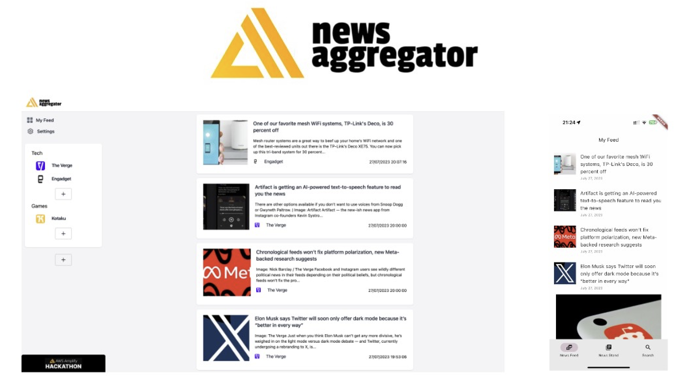

A comprehensive guide to building a news aggregator app using AWS Amplify, Flutter, and React. The app collects news from various sources like RSS, YouTube, and Apple Podcasts, providing users with an enhanced reading experience and concise summaries.

----
### Features

- User authentication with email and Google social login
- News Feed screen for aggregated news
- News Stand screen showcasing all publishers
- Ability to open news articles, play videos, and listen to podcasts
- Admin capabilities for topic creation and publisher addition on the web app

For more details and a step-by-step guide on how to create this news aggregator app, check out the complete article [here](https://tlavrk.hashnode.dev/building-a-news-aggregator-app-with-aws-amplify-flutter-and-react-a-comprehensive-guide).
